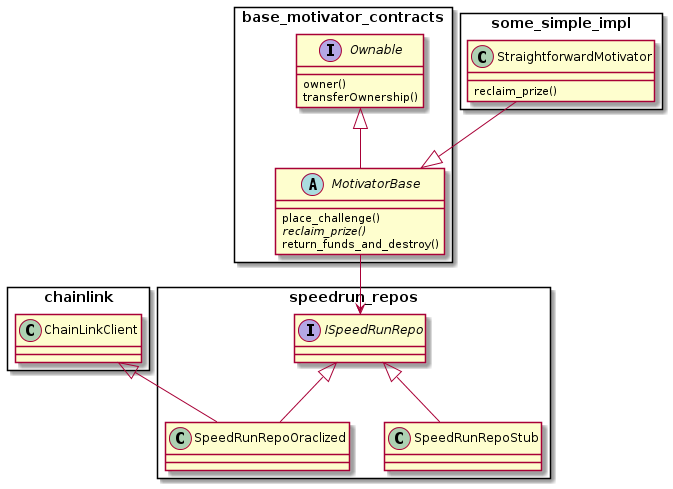

# Notes on smart contract design

## Separation of two main concerns

The design is based on separating two concerns:

* Bringing data from the SpeedRun.com site is responsibility of **repositories**, and the `ISpeedRunRepo` interface attempts to abstract out the fundamental functionality for a variety of implementations.

* The challenges and rewarding part uses the services of repos as a source of data to implement different strategies for distributing rewards. Basic functionality with a partial implementation is in abstract class `MotivatorBase`.

## Extensibility

Both aspects are extensible, so that they define just a basic functionality but let it open the implementation or spawning of future improved services. Examples of those are:

* Creating repository implementations that use oracle networks different from Chainlink in the future, or that use Chainlik in a truly trustless way (the implementation of the prototype is a very basic Chainlink implementation using a single node).

* Creating reward mechanisms that go neyond just giving the reward to the speedrunner. These include redistributing to other runners, even to those who fail to some extent, and imagination could go as far as hooking here tokens, DeFi protocols or DAOs of players that join together as coops of speedrunners.

## Overview

The following UML diagram shows the fundamental aspects of the contract design included in the current basic implementation.
